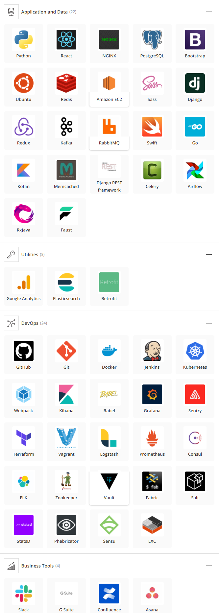

## Overview and Orgin
* Founded April 18, 2013

* Founders are Vladimir Tenev & Baiju Bhatt

* Two students/roommates from Stanford University moved to New York City and sold trading software to hedge funds. They realized the big Wall Street firms they were selling to paid nothing to trade stocks. They built today’s industry standard with a commission free trading application that allows the average investor to trade and sell stocks, cryptocurrency, options, American depositary receipt (ADR) and Exchange Traded Fund (ETF).

* According to [Crunchbase](https://www.crunchbase.com/organization/robinhood) Over 23 rounds of funding equalling $5.6B. Their latest funding was raised on Feb 1, 2021 from a Covertible Note round

***

## Business Activites

* The financial problems RobinHood is resolving are:

    * Providing no barrier of entry for retail investors to invest into stocks, crypto, options, ADRs and ETFs

    * Teaching financial education in the form of Newsletter (RobinHood Snacks) to their user

    * RobinHood’s app is the easiest to watch the stock market. Its intuitive and streamlined, creating a comfortable user experience to watching the performance of your profile and monitor stock prices. Submitting trades are easy and fast

    * New offerings with exclusive access to invest in potential IPOs

    * Offering margin on investing

    *  [Robinhood Gold](https://robinhood.com/us/en/support/my-account-and-login/robinhood-gold/) is premium financial service that gives access to up to $5000 for trading while their deposits clear, access to premium financial analysis (Morning Star), and news Level II Market Data form Nasdaq

* RobinHood’s customer base are beginners who want to invest in fractional shares and cryptocurrencies. Robinhood attracts users with 100% commission free trading, free stocks, and account minimums of $0. The pandemic brought a surge of users to the application, bringing their influx of cash from government stimulus payments.  As of 2020, the user based is reported at 13 million users. Robinhood has contributed to a culture that has “gamified” securities trading into something like a casino. Robinhood makes investing so frictionless and accessible that some people end up trading beyond their knowledge and financial means. 

      

* The unfair advantage RobinHood is doing to its users is selling trade data to quant trading firms like Citdel, 2 Simga Securities, Susquehanna International Group and Virtu Financial. This is not the first time a company has sold its data.  E-trade has earned about $200 million in 2019 selling their user’s trading data.  Their Wall Street clients fed off inexperienced investors who chased volatile momentum stock and invested into risky options trading

   >Forbes 400 members who feast on Robinhood customer trades (from left) Citadel Securities, owned by Ken Griffin; Two Sigma Securities, cofounded by David Siegel; Virtu Financial, founded by Vincent Viola  

## **Tech Stack** 

  

***

## Landscape

* The domain that Robinhood is a part of financial services company offering commission free trading on individual companies, options, ADRs and ETFs. 

* Its new offering of its IPOs will broaden its customer base looking to invest into new startups. Even though with the neagitive situation that happen with Gamestop will not stop its user base growth. Not all publicity is bad publicuty

* The future of Robinhood have three future primary drivers as described on [Morning Star](https://www.morningstar.com/articles/1030652/robinhood-what-to-know-before-it-goes-public)

    >Demographic shift.--The U.S. is undergoing the largest intergenerational wealth transfer in history. As a younger generation takes over their inheritance, they will likely place more importance on investing rather than saving than their predecessors.

    >Preferences for passive investments.--As more consumers turn to passively managed products, there is an opportunity for automated products and technology to replace traditional relationship-based services.

    >Large traditional market.--Alternative wealth-management products represent a small share of global assets under management, leaving them plenty of room to grow in the space and disrupt traditional wealth-management providers.

* There are 7 major companies in this domain:
    1. Charles Schwab
    2. Acorns
    3. Fidlity
    4. Etrade
    5. SoFi
    7. Betterment

* RobinHood average account is $5000

* TD Ameritrade average account $110000 

* Charles Schwab average account is $240000
***
## Results

* Robinhood users do affect all corners of the financial market. As a group their accessibility to move stocks as shown in the GameStop and AMC, have the capability of creating enough traffic to impact entire segments of the market

* How Robinhood makes money is in 5 areas:

    1. Rebates from market markers and trading venues
    2. Robinhood Gold 
    3. Stock Loan
    4. Income Generated from cash
    5. Cash Management

* There are 7 other competitor:

    1. Charles Schwab
    2. Acorns
    3. Fidlity
    4. Etrade
    5. SoFi
    6. Betterment

***
## Recommendation

* Looking at the competitors, some of SoFi services could provide a competitive advantage if mimic by Robinhood. 

    - Access to professional services like Certified Financial Planners.
    - Automated investing like Robo Advisors are a class of financial adviser that provide financial advice or investment management online with moderate to minimal human intervention. They provide digital financial advice based on mathematical rules or algorithms
    - Ability to borrow money
	    - Student loan refinancing
	    - Personal loans
	    - Private Student loans
	    - Home loans
	    - Auto loans
    - These added services would benefit RobinHood it would take away SoFi as another competitor in its Domain. It would broaden its customer base to allow any type of investors to form an investment path with support from certified financial planners, benefit its banks system to lend out many types of loans and the ability to set up their own robo advisors.
    - With RobinHood vast technology stack, it would be easy to implement this solution into its application. Technologies such as Python, Machine learning, Juypter Notebooks, and various tools within their dev-ops ecosystem
* Key takeaway why Robo Advisors would be appropriate solution
    - Automated investment services aimed at ordinary investors—are an increasingly popular way to get access to the markets
    - Robo-advisors are very low-cost and often have no minimum balance requirements. They also tend to follow optimized indexed strategies that are best suited for most investors

Sources:

https://smartasset.com/investing/sofi-vs-robinhood-which-is-better 

https://www.businessinsider.com/personal-finance/robinhood-investing-review#is-robinhood-right-for-you

https://www.businessinsider.com/personal-finance/robinhood-investing-review#is-robinhood-right-for-you

https://www.forbes.com/sites/jeffkauflin/2020/08/19/the-inside-story-of-robinhoods-billionaire-founders-option-kid-cowboys-and-the-wall-street-sharks-that-feed-on-them/?sh=78cb3305268d

https://robinhood.com/us/en/support/articles/how-robinhood-makes-money/

https://www.morningstar.com/articles/1030652/robinhood-what-to-know-before-it-goes-public

